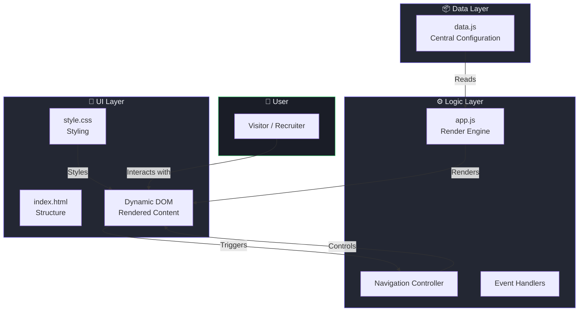
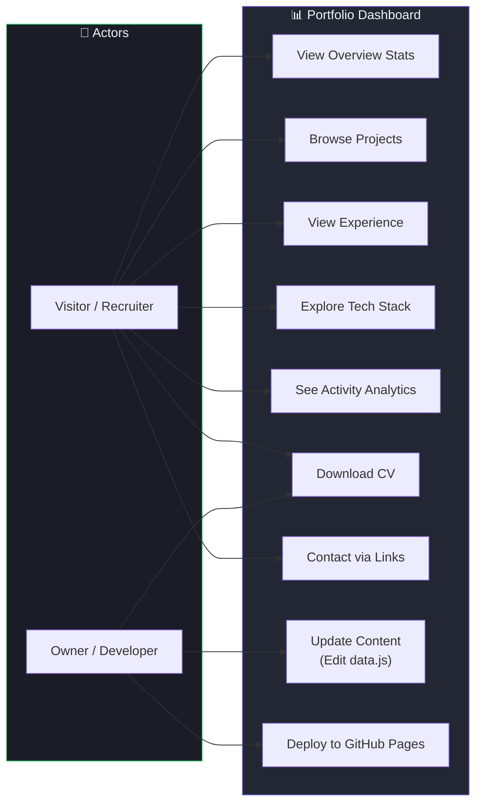
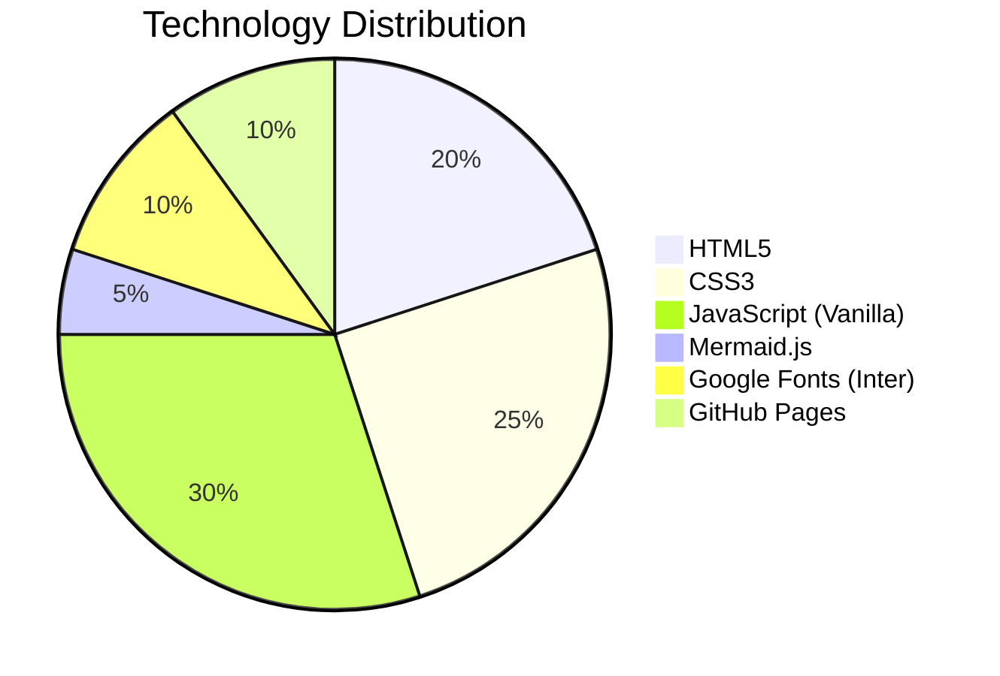
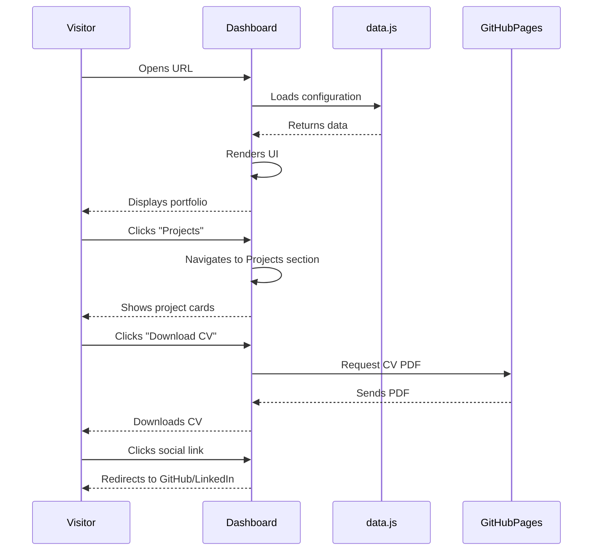

## 📁 **README.md**

# 🚀 Portfolio Dashboard — Personal Command Center

> **Data-driven professional portfolio** built with vanilla HTML, CSS, and JavaScript.  
> Designed as a SaaS-style dashboard, not just a static portfolio.

[](https://your-username.github.io/portfolio)
[](https://)
[](LICENSE)
[](https://github.com/your-username/portfolio/pulls)
[](https://pages.github.com/)

---

## 📋 Table of Contents

- [Overview](#-overview)
- [Features](#-features)
- [Architecture & Data Flow](#-architecture--data-flow)
- [Use Case Diagram](#-use-case-diagram)
- [Tech Stack](#-tech-stack)
- [Project Structure](#-project-structure)
- [Installation & Deployment](#-installation--deployment)
- [Customization Guide](#-customization-guide)
- [Screenshots](#-screenshots)
- [Roadmap](#-roadmap)
- [Contributing](#-contributing)
- [License](#-license)
- [Contact](#-contact)

---

## 📖 Overview

**Portfolio Dashboard** is a modern, data-driven personal portfolio designed to look like a **professional command center**. It presents your professional identity, projects, skills, and activity analytics in a single, clean interface — perfect for developers, designers, and tech professionals who want to stand out.

Unlike traditional static portfolios, this dashboard is **fully configurable via a single data file** (`data.js`), making it easy to update content without touching HTML or CSS.

---

## ✨ Features

| Feature | Description |
|---------|-------------|
| 📊 **Overview Stats** | Quick glance at projects, repos, skills, and experience |
| 👤 **About Section** | Professional bio with tech tags |
| 📁 **Featured Projects** | Cards with status (active/archived), tech stack, and live links |
| ⚡ **Tech Stack** | Grouped by category (Frontend, Backend, DevOps, etc.) |
| 📈 **Activity Analytics** | Contribution bars & project category distribution |
| 💼 **Experience Timeline** | Work history with visual timeline |
| 🎨 **SaaS-Style UI** | Dark mode, sidebar navigation, smooth animations |
| 📱 **Fully Responsive** | Works on all screen sizes |
| 🔄 **Data-Driven** | Update `data.js` → dashboard updates instantly |
| 📄 **Download CV** | One-click CV download (configurable) |

---

## 🏗️ Architecture & Data Flow



---

## 📊 Use Case Diagram



### Detailed Use Case Description

| Use Case | Actor | Description |
|----------|-------|-------------|
| **View Overview Stats** | Visitor | See key metrics (projects, repos, skills, experience) at a glance |
| **Browse Projects** | Visitor | Explore featured projects with tech stack, status, and live demos |
| **View Experience** | Visitor | Read work history in a visual timeline |
| **Explore Tech Stack** | Visitor | Discover technologies grouped by category |
| **See Activity Analytics** | Visitor | View contribution graph and project category distribution |
| **Download CV** | Visitor / Owner | Download the professional CV in PDF format |
| **Contact via Links** | Visitor | Access social links (GitHub, LinkedIn, Email) |
| **Update Content** | Owner | Modify `data.js` to update all dashboard content |
| **Deploy to GitHub Pages** | Owner | Deploy the dashboard to GitHub Pages for public access |

---

## 🛠️ Tech Stack



| Layer | Technology |
|-------|------------|
| **Markup** | HTML5 (Semantic Elements) |
| **Styling** | CSS3 (Custom Properties, Grid, Flexbox, Animations) |
| **Logic** | Vanilla JavaScript (ES6+) |
| **Font** | Google Fonts — Inter |
| **Icons** | Emoji / Unicode (no external icon library) |
| **Hosting** | GitHub Pages |
| **Diagram** | Mermaid.js (for documentation) |

---

## 📂 Project Structure

```
portfolio/
├── index.html                    # Main HTML entry point
├── README.md                     # This documentation
├── LICENSE                       # MIT License
├── assets/
│   ├── images/                   # Screenshots, profile pics
│   ├── icons/                    # Custom icons (optional)
│   └── cv.pdf                    # Your downloadable CV
├── css/
│   └── style.css                 # All styles (dark theme, responsive)
└── js/
    ├── data.js                   # 🔥 CENTRAL DATA — edit this only!
    └── app.js                    # Render engine & navigation logic
```

---

## 🚀 Installation & Deployment

### Local Development

1. **Clone the repository**
   ```bash
   git clone https://github.com/your-username/portfolio.git
   cd portfolio
   ```

2. **Open with Live Server** (VS Code extension) or simply open `index.html` in your browser.

3. **Edit `data.js`** with your personal information.

4. **Preview** changes instantly — no build step required!

### Deploy to GitHub Pages

1. **Create a repository** named `your-username.github.io` or `portfolio`.

2. **Push the code**
   ```bash
   git init
   git add .
   git commit -m "Initial commit: Portfolio Dashboard"
   git remote add origin https://github.com/your-username/portfolio.git
   git push -u origin main
   ```

3. **Enable GitHub Pages**
   - Go to repository **Settings → Pages**
   - Select branch: `main`, folder: `/root`
   - Click **Save**

4. **Access your dashboard**
   ```
   https://your-username.github.io/portfolio/
   ```

---

## 🎨 Customization Guide

### 1. Update Personal Data
Edit `js/data.js` — all content is centralized here:

```javascript
const portfolioData = {
  stats: { totalProjects: 12, ... },
  about: { name: "Your Name", bio: "...", ... },
  techDistribution: [ ... ],
  projects: [ ... ],
  skills: { Frontend: [...], ... },
  contributions: [ ... ],
  categories: { ... },
  experiences: [ ... ],
  contacts: { ... },
};
```

### 2. Change Theme Colors
Edit CSS variables in `css/style.css`:

```css
:root {
  --bg-primary: #0f1117;      /* Main background */
  --accent: #6c5ce7;          /* Primary accent color */
  --accent-light: #8b7cf7;    /* Hover state */
  /* ... more variables */
}
```

### 3. Add/Remove Sections
Modify `index.html` — each section is a `<section>` with `id` matching the sidebar navigation.

### 4. Update CV
Replace `assets/cv.pdf` with your own PDF, and update the link in `app.js`:

```javascript
function downloadCV() {
  window.location.href = 'assets/cv.pdf';
}
```

---

## 📸 Screenshots

### Dashboard Overview
```
┌─────────────────────────────────────────────────────────────┐
│ ANDRE SAPUTRA              Available ●    GitHub  LinkedIn │
├──────────────┬──────────────────────────────────────────────┤
│              │  📊 Overview                                │
│  📊 Overview │  ┌────────┐ ┌────────┐ ┌────────┐ ┌──────┐ │
│  📁 Projects │  │Projects│ │ GitHub │ │ Skills │ │Exp.  │ │
│  💼 Experience│  │   12   │ │   35   │ │   18   │ │  3y  │ │
│  ⚡ Skills   │  └────────┘ └────────┘ └────────┘ └──────┘ │
│  📈 Activity │                                              │
│  ✉️ Contact  │  About                        Tech Dist.     │
│              │  Fullstack developer...       JavaScript ████│
│              │  #React #Node #TS             TypeScript ███│
├──────────────┴──────────────────────────────────────────────┤
│  📁 Featured Projects                                      │
│  ┌─────────────────────┐  ┌─────────────────────┐         │
│  │ ● Project Alpha     │  │ ● Project Beta      │         │
│  │ React · Node · WS   │  │ Python · AI · React │         │
│  │ [GitHub] [Live]     │  │ [GitHub] [Live]     │         │
│  └─────────────────────┘  └─────────────────────┘         │
└─────────────────────────────────────────────────────────────┘
```

---

## 🗺️ Roadmap

- [x] ✅ Core dashboard layout
- [x] ✅ Data-driven architecture
- [x] ✅ Responsive design
- [x] ✅ Dark theme
- [x] ✅ Navigation sidebar
- [x] ✅ Project cards with status
- [x] ✅ Tech distribution chart
- [x] ✅ Contribution graph
- [ ] 🔲 Dark/Light mode toggle
- [ ] 🔲 GitHub API integration (fetch repos automatically)
- [ ] 🔲 Search & filter projects
- [ ] 🔲 Blog/Articles section
- [ ] 🔲 Interactive 3D background
- [ ] 🔲 PDF export of portfolio
- [ ] 🔲 Multi-language support

---

## 🤝 Contributing

Contributions are welcome! Here's how:

1. **Fork** the repository
2. **Create a branch** (`git checkout -b feature/amazing-feature`)
3. **Commit changes** (`git commit -m 'Add amazing feature'`)
4. **Push** (`git push origin feature/amazing-feature`)
5. **Open a Pull Request**

### Development Guidelines
- Use semantic HTML5 elements
- Write clean, commented CSS
- Follow ES6+ JavaScript conventions
- Keep `data.js` as the single source of truth

---

## 📄 License

This project is licensed under the **MIT License** — see the [LICENSE](LICENSE) file for details.

```
MIT License

Copyright (c) 2026 [Your Name]

Permission is hereby granted, free of charge, to any person obtaining a copy
of this software and associated documentation files (the "Software"), to deal
in the Software without restriction, including without limitation the rights
to use, copy, modify, merge, publish, distribute, sublicense, and/or sell
copies of the Software, and to permit persons to whom the Software is
furnished to do so, subject to the following conditions...
```

---

## 📬 Contact

**Andre Saputra**  
📧 [andresaputra@dev.com](mailto:andresaputra@dev.com)  
🐙 [github.com/andresaputra](https://github.com/andresaputra)  
🔗 [linkedin.com/in/andresaputra](https://linkedin.com/in/andresaputra)  

---

## 🙏 Acknowledgments

- Built with ❤️ using vanilla technologies — no frameworks, no dependencies.
- Inspired by modern SaaS dashboards and data-driven design principles.
- Special thanks to the open-source community for continuous inspiration.

---

<div align="center">
  <sub>Built with ⚡ by <a href="#">Andre Saputra</a></sub>
  <br />
  <sub>⭐ Star this repo if you find it useful!</sub>
</div>
```

---

## 🏷️ Badge Pilihan (Tambahan)

Kalau mau tambah badge yang lebih keren lagi, ini beberapa opsi tambahan yang bisa kamu pakai:

```markdown
<!-- Badge tambahan yang bisa disisipkan di bagian atas README -->

[](https://your-username.github.io/portfolio)
[](https://github.com/your-username/portfolio/graphs/commit-activity)
[](https://github.com/your-username/portfolio/commits/main)
[](https://github.com/your-username/portfolio)
[](https://github.com/your-username/portfolio/stargazers)
[](https://github.com/your-username/portfolio/network)
[](https://wakatime.com/@your-username)
```

---

## 📊 Mermaid Diagram Tambahan (Flowchart Interaksi User)

Kalau mau tambahan diagram untuk **interaksi user dengan dashboard**, ini bisa dimasukkan juga:


